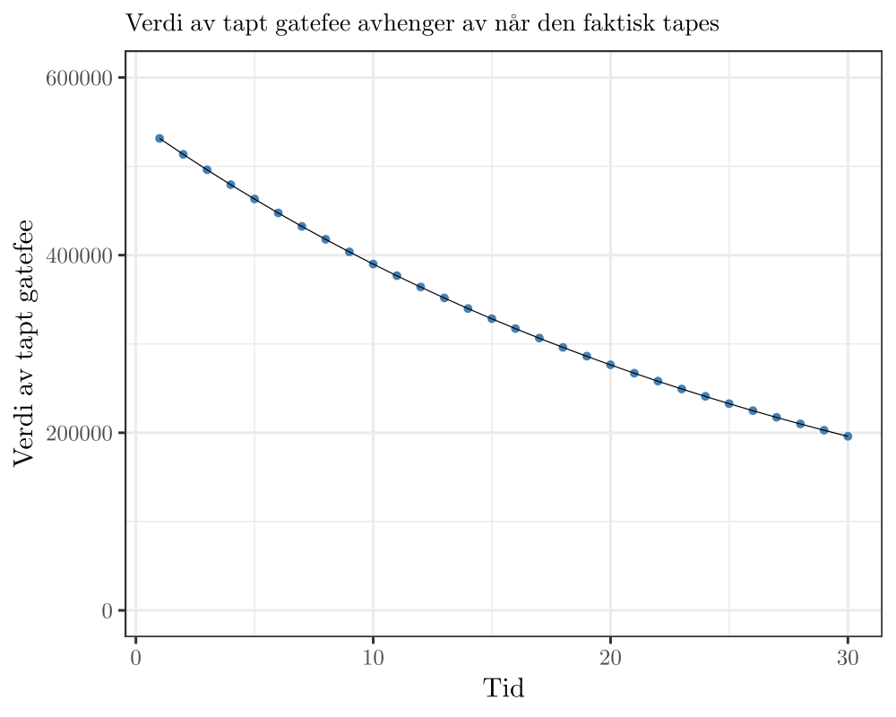

# Forutsetninger i vurdering

I denne delen forklares hvordan beslutningsverktøyet kommer frem til vurderingen av kritisk dato og hvorvidt en reservedel skal bestilles/ikke bestilles (til lager). 

## Overordnet vurdering

Dataen som mates inn i modellen blir brukt til å vurdere to ting:

1. Hvilken risiko tar Returkraft på seg ved å ikke ha reservedel på lager
2. Hvilken lagerkostnad tar Returkraft på seg ved å ha reservedel på lager

Disse to faktorene blir sannsynlighetsvektet og satt opp mot hverandre, og modellen skal si at en reservedel skal holdes på lager fra og med den dagen hvor risikoen Returkraft tar på seg er større enn lagerkostnaden.

## Risiko ved å ikke ha reservedel på lager

For å vurdere hvilken risiko Returkraft tar på seg ved å ikke ha en reservedel på lager, er det spesielt tre ting å ta hensyn til:

1. Vil defekt føre til stans i avfallsforbrenning?
2. Vil defekt føre til stans i strømproduksjon?
3. Hvor lang tid vil det ta å fremskaffe ny del?

Ved stans i avfallsforbrenning regner verktøyet med en tapt gatefee på kr 440 000 per døgn. Dette tapet er justert ned til kroner i dag med en viss *diskonteringsrente*, foreløpig satt til 4% pr år. Selv om en defekt fører til stans i avfallsforbrenning, vil en kunne motta avfall en viss tid (frem til bunkers er full). Tapet vil med andre ord ikke komme umiddelbart ved defekt, men idet bunkers er full. I denne versjonen av verktøyet antas det at en kan motta avfall frem til defekten er reparert, og tapet vil ikke oppstå før anlegget ev. stenges ned permanent. Et tap på kr 550 000 om 30 år er verdt ca halvparten, og det er denne verdien som ligger til grunn i verktøyet.

